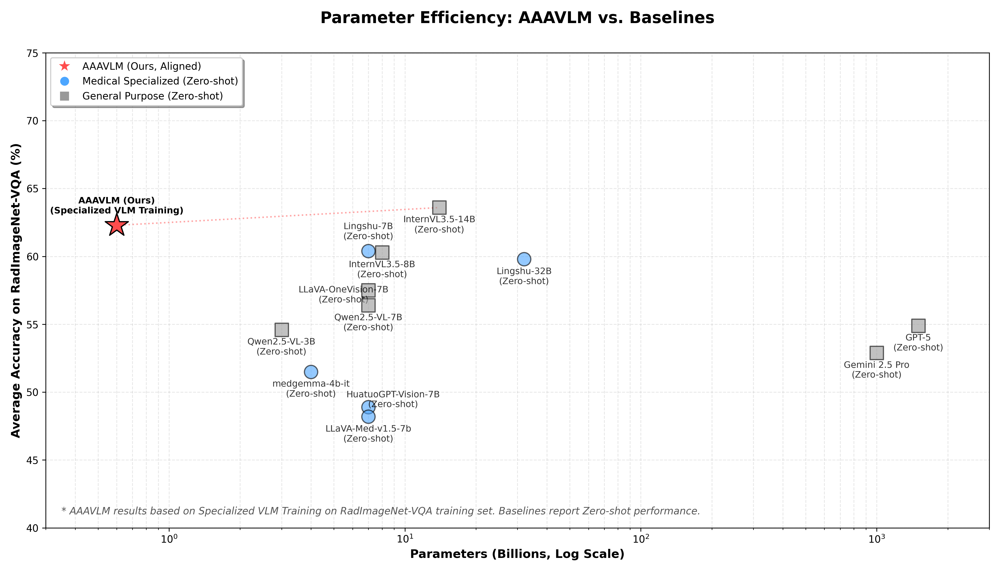

> 🚧 **Work in Progress**
> 
> 感谢关注 AAAVLM。本项目目前处于活跃开发阶段。
> 
> **当前进展：**
> 
> 我们已在 RadImageNet-VQA 评测基准上验证了架构的有效性。在仅使用 MRI 数据进行监督微调 (SFT) 的情况下，基于 Qwen3-0.6B 的轻量化方案达到了 62.29% 的平均准确率。这一成绩证明了 AAAVLM 在处理复杂 3D 医疗影像时的强大潜力。
> 
> **我们的愿景：从 VQA 专家到医学 Foundation Model**
> 
> 虽然目前的代码初步聚焦于 VQA 任务，但我们的长远目标是构建一个能够理解 3D/2D 全模态医学影像的通用**基础模型 (Foundation Model)**。
> 
> • 📚 数据集扩充：我们正在紧张地适配更多高质量医疗数据集（涵盖 MRI 的多种病灶与解剖结构），以增强模型的泛化能力。
> 
> • 🏗️ 代码重构：为了支撑更大规模的数据和模型训练，我们正在梳理和重构部分早期的实验性代码。
>
> 核心代码与预训练权重将随着重构进度逐步释出！Coming Soon！

# AAAVLM 🧠

> **A**ny-dimension **A**ligned **A**natomy **VLM**，3D/2D 统一的参数医学影像视觉语言模型。

<div align="center">
  
  <p>AAAVLM 在 RadImageNet-VQA 上的推理示例</p>
</div>

---

## 🎯 项目简介

AAAVLM 采用 **Encoder + Projector + LLM** 的三段式架构，专为医学影像设计，可同时处理 3D 体数据与 2D 图像。项目具有极高的算力性价比，支持：

* 🔬 **MIM 预训练**（Stage 1）：Masked Image Modeling，学习通用医学视觉表征。
* 🔗 **Projector 对齐**（Stage 2）：将 3D/2D 视觉特征高效投影至 LLM 文本空间。
* 📝 **VLM 微调**（Stage 3）：在医学 VQA 数据上进行监督微调 (SFT)，支持 LoRA 降维训练。

**技术栈**：SparsedEncoder + Projector + Qwen3-0.6B。

---

## 🏆 性能基线 (Performance)

在 **RadImageNet-VQA** 评测基准上，AAAVLM (0.6B) 展现出了极具竞争力的性能。

**评测声明与实验设定**：

* **参数规模**：采用 Qwen3-0.6B 作为极小语言底座。
* **数据分布**：当前基线权重主要基于数据集中的 **MRI 单模态数据** 进行监督微调 (SFT)，在包含 CT/MRI 的全量测试集上展现了优异的跨模态泛化潜力。
* **严苛评测**：摒弃了常规脚本中易造成“幻觉骗分”的子串匹配 (如 `normal in abnormal`)，采用了**严格去标点与正则词边界 (`\b`)** 的纯净评测协议，确保分数的绝对真实性。

**RadImageNet-VQA Test-set Results (Special VLM Training on RadImageNet-VQA Training Set):**

| Model | | Anatomy | | | Abnormality | | Pathology | | | Average |
|-------|------|---------|--------|------|-------|------|---------|--------|------|-----|
| | Open | Closed+ | Closed– | MC | Closed | Open | Closed+ | Closed– | MC | |
| **AAAVLM-0.6B** | 65.80 | 81.50 | 66.70 | 77.90 | 71.40 | 26.60 | 57.86 | 66.28 | 46.60 | **62.29** |

与多个通用与医疗专用视觉语言模型的 **zero-shot** 评测结果相比，AAAVLM 作为小模型展现了一定的竞争力。

<div align="center">
  
  <p>AAAVLM 在 RadImageNet-VQA 上的参数效率与性能对比</p>
</div>

1. AAAVLM 虽然在 RadImageNet-VQA 上进行了专门的训练，但其参数规模远小于所有 zero-shot 基线模型，展现了一定潜力。
2. AAAVLM 仅使用 MRI 数据进行训练，但在包含 CT/MRI 的全量测试集上展现了较好的跨模态泛化能力。

[具体结果链接](https://huggingface.co/datasets/raidium/RadImageNet-VQA)

---

## 📦 环境安装

**要求**：Python 3.10+，CUDA，约 16GB+ GPU 显存（视 batch size 而定）。

```bash
pip install -r requirements.txt

```

---

## ⚡ 启动方式

**原则**：单卡用 `python` 直接启动，多卡用 DeepSpeed。**该规则适用于训练的全部三个阶段**。

| GPU 数量 | 启动命令 |
| --- | --- |
| 🖥️ 1 卡 | `python AAAVLM/train/MIM_train.py [args]` |
| 🚀 多卡 (N) | `deepspeed --num_gpus=N AAAVLM/train/MIM_train.py --deepspeed ./scripts/zero2.json [args]` |

**适用入口**：

* Stage 1：`MIM_train.py`
* Stage 2：`projector_train.py`
* Stage 3：`vlm_finetune_vqa.py`（Alignment 与 Instruct 均适用）

💡 *提示：将上述命令中的 `MIM_train.py` 替换为对应阶段的脚本即可。*

---

## 🚀 快速开始

三阶段按严格的依赖顺序执行，后续阶段需加载前一阶段的权重输出：

```text
Stage 1 (MIM)  →  Stage 2 (Projector)  →  Stage 3 (VLM 微调)
     ↓                    ↓                        ↓
pretrained_encoder   projector.pt          完整 VLM checkpoint

```

| 阶段 | 脚本示例 | 数据集需求 |
| --- | --- | --- |
| **Stage 1** | `MIM_train_RadImageNet_VQA_2D_2.sh` | `mim.jsonl` / `vqa.jsonl` |
| **Stage 2** | `projector_train_RadImageNet_VQA_alignment.sh` | `alignment vqa.jsonl` |
| **Stage 3** | `vlm_finetune_RadImageNet_VQA_instruct.sh` | `instruct vqa.jsonl` |

所有脚本均位于 `AAAVLM/scripts/`，请务必从 **项目根目录** 执行，例如：

```bash
bash AAAVLM/scripts/vlm_finetune_RadImageNet_VQA_instruct.sh

```

---

## 📂 数据准备

### 各阶段数据集格式

| 阶段 | 格式 | 文件示例 | 每行核心字段 |
| --- | --- | --- | --- |
| **Stage 1 (MIM)** | JSONL | `mim.jsonl` <br>

<br> `vqa.jsonl` | `{"image": path, "type": "2D" |
| **Stage 2/3 (VLM)** | JSONL | `vqa.jsonl` | `{"image": path, "question": text, "answer": text, "type": "2D" |

* **路径支持**：可直接指定 `.jsonl` 文件，或指向目录（代码将依次查找 `mim.jsonl`、`data.jsonl`、`vqa.jsonl`）。
* **自定义数据集**：适配新数据集时，只需按上述 JSONL 格式产出映射关系即可无缝参与训练。

### 常用数据集适配器

**1. RadImageNet-VQA** (适配脚本位于 `data_adapter/RadImageNet-VQA/`)：
| 适配脚本 | 输出产物 | 用途说明 |
| :--- | :--- | :--- |
| `adapter_alignment.py` | `alignment/vqa.jsonl` | MIM 预训练、Projector 对齐、VLM Alignment 微调 |
| `adapter_instruct.py` | `instruct/vqa.jsonl` | VLM Instruct 最终微调 |

**2. BraTS2020 / OpenMind** (MIM 预训练数据)：
| 适配脚本 | 输出产物 |
| :--- | :--- |
| `data_adapter/BraTS2020/prepare_datalist_mim.py` | `data/BraTS2020/mim.jsonl` |
| `data_adapter/OpenMind/prepare_datalist.py` | `data/OpenMind/mim.jsonl` |

---

## 📈 评测与推理 (Evaluation)

项目在 `AAAVLM/benchmark/` 目录下提供了完整的工业级评估体系：

* **严苛评估 (RadImageNet-VQA)**：在 Test 集上基于词边界正则匹配进行客观评估。支持按 `question_type`、`content_type` 分组输出 10 列标准准确率表格。
* **可视化推理 (Inference)**：支持抽样推理并生成 HTML 格式的可视化问答报告。

```bash
# 执行 RadImageNet-VQA 客观评估
python AAAVLM/benchmark/RadImageNet-VQA/run_eval.py \
    --checkpoint <path> --encoder <path> --llm_path <path> --benchmark_data <path>

# 生成 HTML 抽样推理报告
python AAAVLM/benchmark/inference/run_inference.py \
    --checkpoint <path> --encoder <path> --benchmark_data <path>

```

📚 详见 [Benchmark 综合说明](https://www.google.com/search?q=AAAVLM/benchmark/README.md) 与 [RadImageNet-VQA 评测细则](https://www.google.com/search?q=AAAVLM/benchmark/RadImageNet-VQA/README.md)。

---

## 📁 目录结构

```text
MRI3DVLM/
├── AAAVLM/              # 核心代码库
│   ├── model/           # Encoder, Projector, LLM 组装逻辑
│   ├── dataset/         # DataLoader, 特殊的数据打包黑魔法 (VLMDataset)
│   ├── train/           # 三阶段训练入口脚本
│   ├── benchmark/       # 评测脚本与 HTML 可视化推理
│   └── scripts/         # 训练启动的 Shell 脚本
├── data_adapter/        # 多源数据集清洗与转换脚本
├── task/                # 下游任务 (如 BraTS2020 分割等)
├── scripts/             # DeepSpeed zero2.json 等分布式配置文件
├── data/                # 原始与处理后的数据存储根目录
├── output/              # Checkpoint 与训练日志输出
└── doc/                 # 架构梳理、设计思想与实验记录

```

---

## 📚 文档导读

为了帮助开发者快速理解本项目的设计思想，我们提供了详细的说明文档：

* 📖 [架构梳理 (Architecture)](https://www.google.com/search?q=doc/%E6%9E%B6%E6%9E%84%E6%A2%B3%E7%90%86.md)：深入浅出地讲解模型结构、训练流及数据打通逻辑。
* 📖 [设计理念 (Design)](https://www.google.com/search?q=doc/design.md)：阐述 MIM、Encoder 稀疏化以及显存零拷贝膨胀等底层技术细节。
* 📋 [更改日志 (Changelog)](https://www.google.com/search?q=doc/%E6%9B%B4%E6%94%B9%E6%97%A5%E5%BF%97.md)：版本迭代记录。

---

## ✅ 单元测试

项目包含基础回归测试，确保环境与算子运行正常：

```bash
# 请在项目根目录下执行
bash AAAVLM/test_case/run_all_tests.sh

```

*测试结果将生成于：`AAAVLM/test_case/output/test_report.md*`

---

## TODO

- [ ] 加入更多的 MRI 数据集进行训练
- [ ] 支撑多种下游任务，如医学图像分割、医学图像分类等
- [ ] 支持更大规模的 LLM 底座切换（如 Qwen3-4B）
